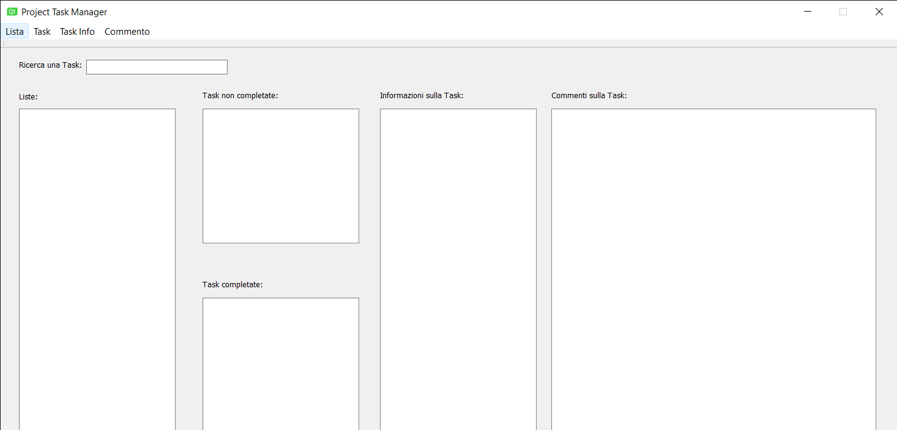
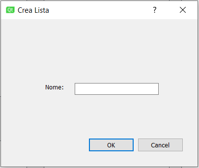
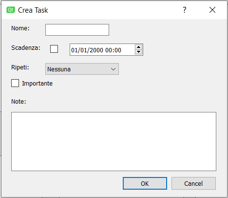
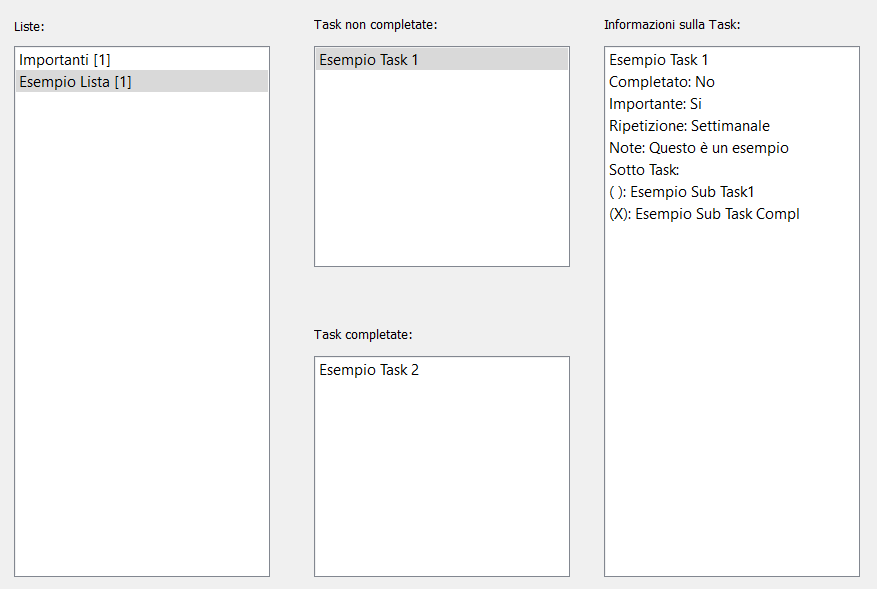
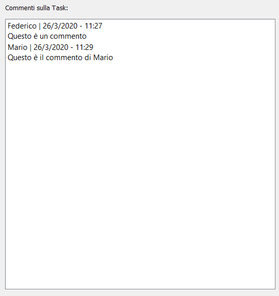
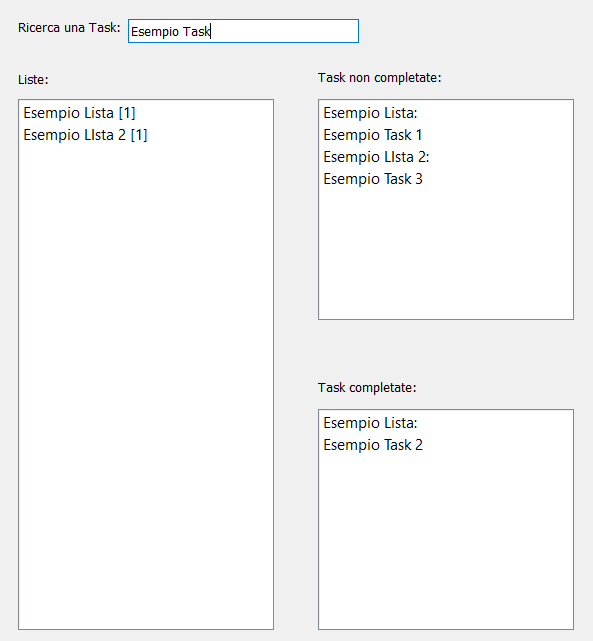

# Task Manager

## Come utilizzare il programma

### Schermata principale: 

### Come creare una nuova lista:

Cliccare in alto a sinistra sul pulsante "Lista" e selezionare l'azione desiderata nel menù a tendina che comparirà.  
Per esempio se si vuole creare una nuova lista comparirà la seguente finestra.  

### Come gestire le task delle mie liste:  

Una volta creata la propria To Do List, se si vuole aggiungere una o più task è necessario selezionare la lista interessata e poi cliccare sul pulstante "Task" e poi "Aggiungi".  
In questa finestra è possibile aggiungere diversi aspetti alla propria Task come ad esempio selezionare una "data di scadenza", dare una ripetizione oppure se è più importante rispetto ad altre mettere la spunta su "Importante". In quest'ultimo caso la Task comparirà anche in una apposita lista dove poter controllare tutte le Task importanti delle proprie To Do List.  
Le Task sono suddivise in due aree distinte, quella in alto dove si trovano quelle da completare, mentre in quello in basso stanno le Task che sono state completate. In qualsiasi momento è possibile settare le Task selezionando quella desiderata e cliccando su "Completa Task" oppure viceversa cliccando su "Imposta non Completata".

  

Inoltre è possibile aggiungere Sotto-Task a tutte le Task se si vuole includere più dettagli, ad esempio:  
 
Lista -> Spesa  
Task -> Biscotti  
Sotto-Task -> Marie  
  
Per gestire le Sotto-Task è necessario selezionare una Task e poi cliccare sul pulsante "Task Info".  
Le informazioni su ogni Task appariranno, nel momento della selezione, in un apposito spazio sulla destra dove si può consulatare ogni caratteristica.  

  

### Come gestire i commenti:  

Selezionando una Task è infine possibile aggiungere un proprio commento a riguardo cliccando sul pulsante "Commento" e poi "Aggiungi Commento".  

  

### Ricerca Task:  

Per cercare una Task tra tutte le liste, inserirne il nome nell'apposita sezione "Ricerca una Task". I risultati saranno suddivisi per Task da completare e Task completate.  

